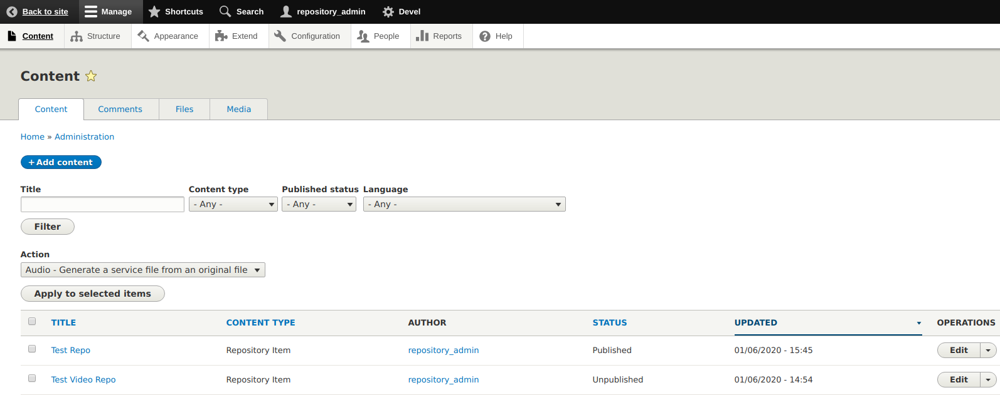
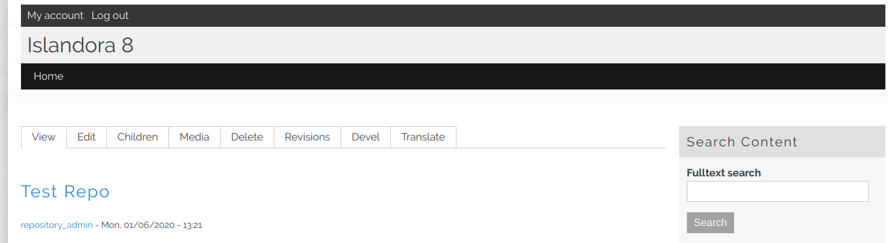
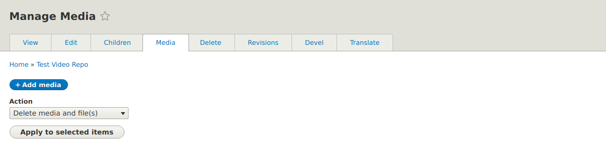
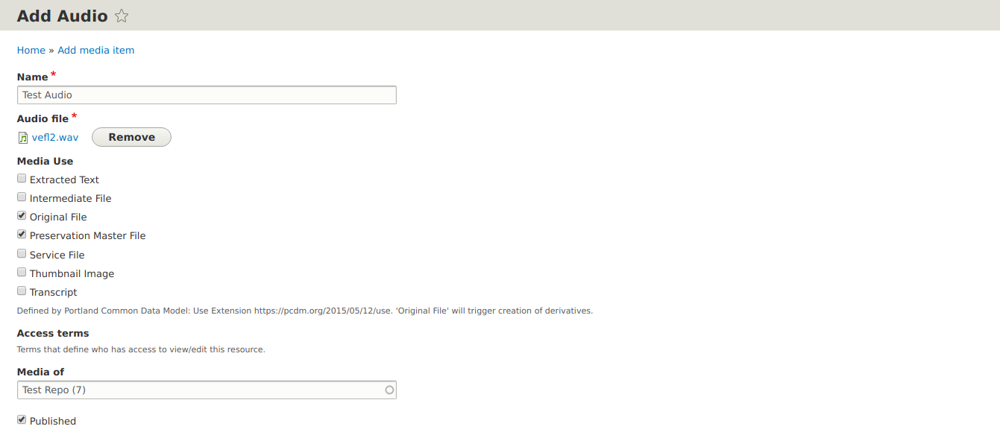
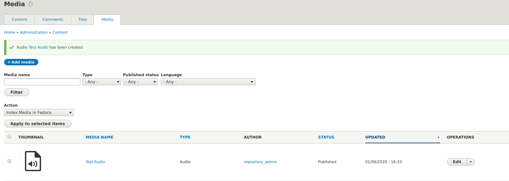
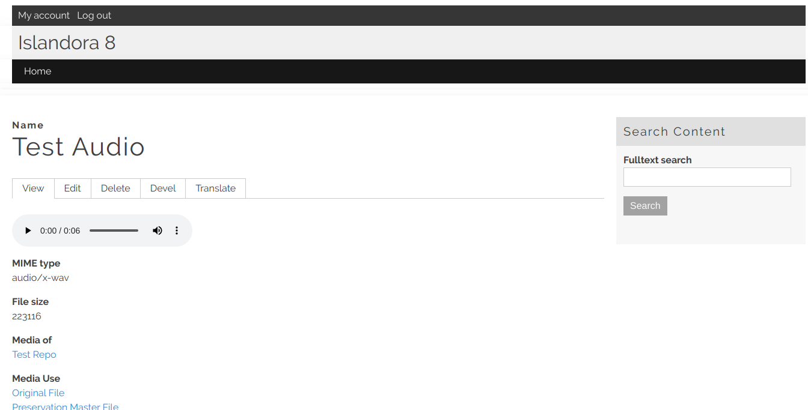

The audio media item accepts a single file of the following filetypes as input. 
   
>_MP3_, 
>_WAV_, 
>_AAC_ 
 
We can either add an audio file to existing content or by creating an audio collection and then adding the audio files. 
 
For more information on creating an audio repository item [Click this Link](https://islandora.github.io/documentation/user-documentation/collections/) 
 
On the Create Repository Item we will leave most of the things as default and on the system form we will add audio as the **Model** and for the display hints, we will leave it blank. 

## Add Media Item (Audio) 

1. To add an audio file, first login as an administrator and click on the content tab to the top left of your site. The content page will be loaded, select the content repository you want to use from the available list. 

 

2. You will now be redirected to the view page of the specific repo that you did click. 

 

3. One of the view page click on the media button then click on the **+ Add media** button. 

 

4. Now you will see a list of various media types select **Audio** a continue. The Add audio form will now be visible. Add the name of the audio file you want to upload, 
upload the file and for media use select Original file and Preservation master file and leave the rest as default and save the form. 
 
 
 
5. Once the form is saved, you will be redirected to the Media page where the file you have uploaded will be the first on the list as seen below. 
 
 
 
6. For viewing the audio file, just click on the file you have created from the above list and the audio file and its details will be viewable. 
 
 
 
With the above steps, you are able to upload an audio file to your existing repository on islandora 8.
