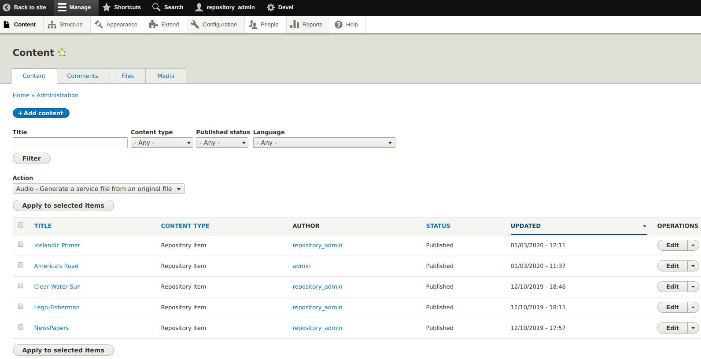
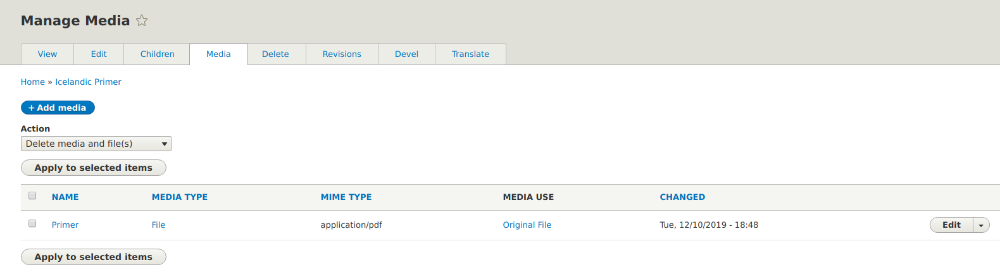
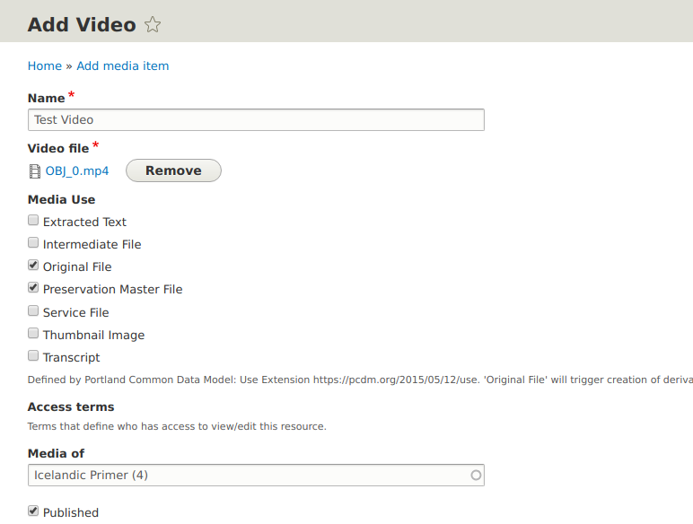
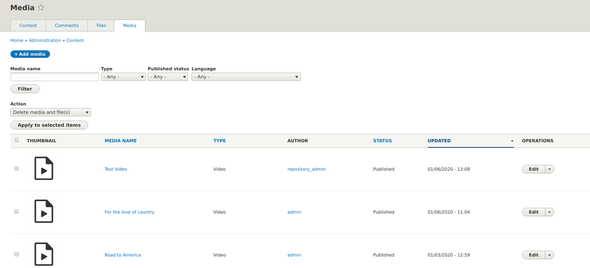
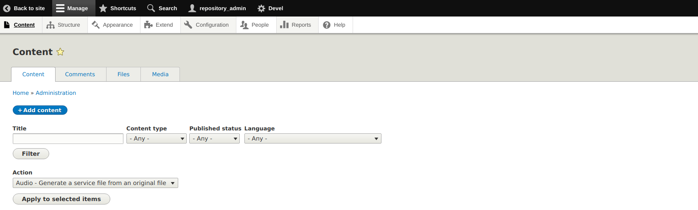
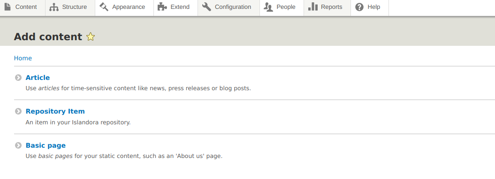
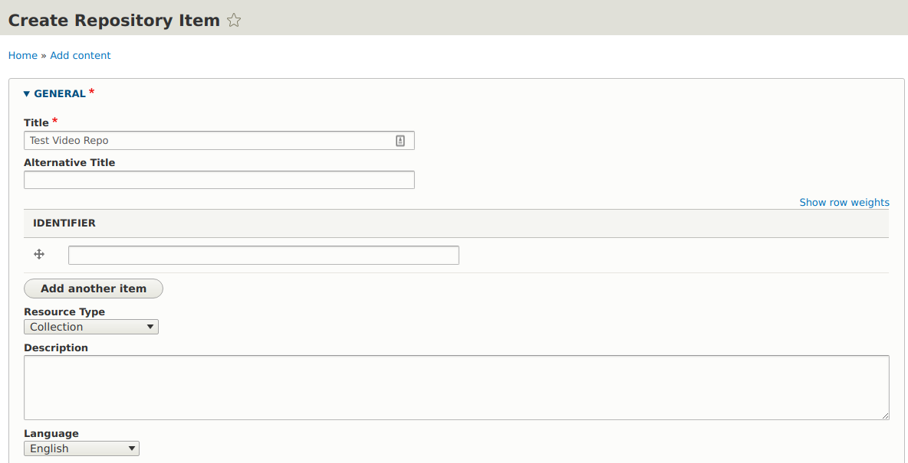
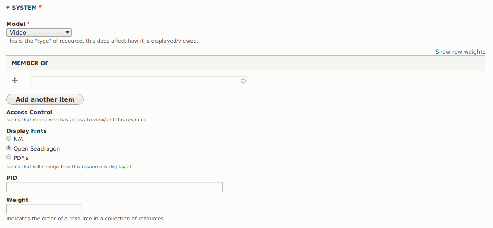

The video media item accepts a single file of the following filetype as input. 
   
>_MP4_ 
 
To learn more about media please visit the [Media Page](https://islandora.github.io/documentation/user-documentation/media/). 
 
## Adding a Video 
 
We can add a video on Islandora 8 by using the existing content collection or creating a collection repository item for uploading videos. 
 
### Uploading video to an existing Content. 
 
In order to add a video, you will first login to your islandora 8 site as an administrator. 
 
1. Once logged in, on the top left corner of your site, click on the Manage button then click on the Content tab and you will be redirected to the content page as shown below. 
 
 
 
1. Click on any of the available content (will be using the Icelandic Primer) and you will be redirected to the page related to that content, now click on media as shown below. 
 
 
 
1. Click on the + Add media page and select the video as shown below. The allowed types for video is MP4. In terms of Media use, we will select the original file and also the Preservation Master File as below. 
 
 
 
Once done filling the form, save it and you will be redirected to the Media page, where the saved page is the first on the list. Click on the saved file and view it. 
 
 
 
### Creating Repository Collection for Videos 
 
1. From the islandora 8 site, click on the button and you will be redirected to the content page as below. 
 
 
 
1. Click on the + Add content button and you will be redirected to a page to select the type of content to add, select the Repository Item and continue. 
 
 
 
Now we can create our repository item. The form is split in two, General and System. On the general form, we fill in the title of the repository and for the resource type, we can select a collection or leave it blank. 
 
 
 
For the system form, on the model drop-down, we select the video and for the Display hints we can select Open Seadragon and we can now save the form. 
 
 

1. Once the form is saved you are redirected to the view page for the repository item you have created from there you can click the media button and follow the instructions from step 3 of Adding video. 
 
For more information on how to create collections, please visit [Collections](https://islandora.github.io/documentation/user-documentation/collections/).
